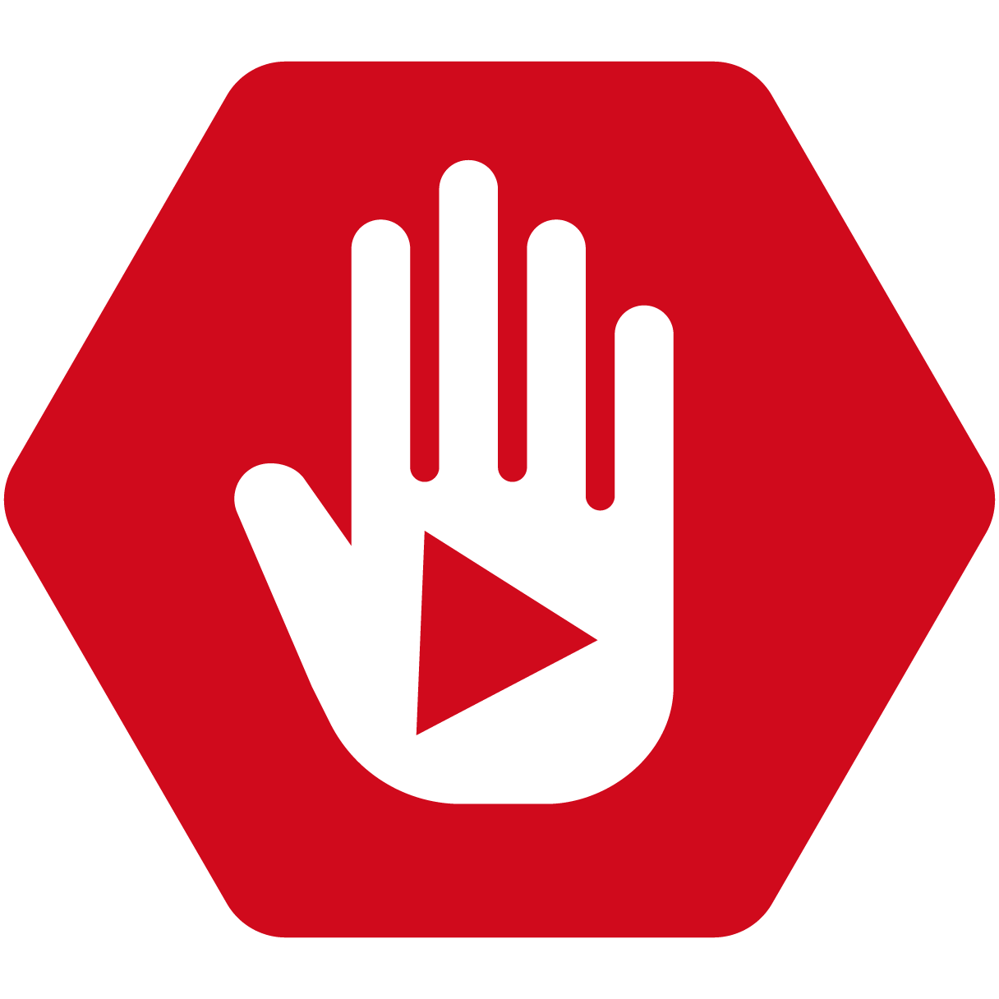

# Keyword Blocker

## Block Youtube Videos based on specified keywords

This web extension can block YouTube videos or channels from view based on keywords you can specify.
It features a very basic password protection and the block message is user-customizable.

Originally this was developed for a person who is easily scared and needed to be protected from certain YouTube searches. Because there was no easy way to do this I developed this extension.

Get it in the [Chrome Webstore](https://chrome.google.com/webstore/detail/keyword-blocker/pbgacppomjfpheddhifkdkklddnolnpg)
or for [Firefox](https://addons.mozilla.org/en-US/firefox/addon/keyword-blocker/)

## Build instructions

- checkout the repository and run npm install
- npm run dev will build a development version of the extension in the dist folder
- npm run dist will build the release version

Note:

- Due to a bug in html-webpack-plugin injected paths to the stylesheets will have a backslash instead to a forward slash. This will lead to problems when running the plugin on firefox.
- If you build on Mac/Linux/Windows Subsystems for Linux it will work as expected
